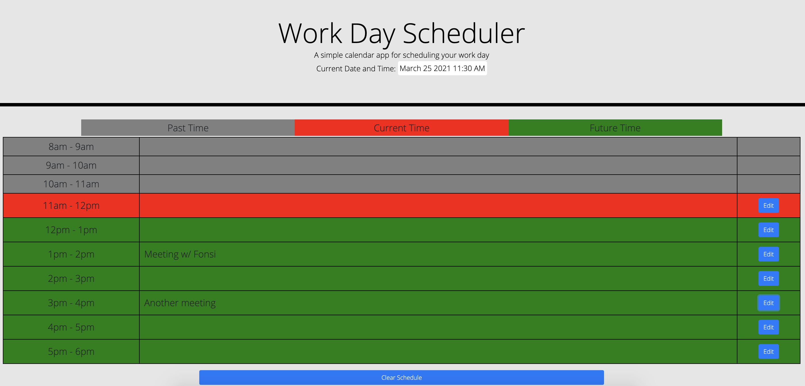

# 05 Third-Party APIs: Work Day Scheduler

## Your Task

Create a simple calendar application that allows a user to save events for each hour of the day by modifying starter code. This app is available to view in the browser here: https://epurpur.github.io/Bootcamp5_WorkDayScheduler/

This app uses the following libraries: [Moment.js](https://momentjs.com/), [Bootstrap](https://getbootstrap.com/), [jQuery](https://api.jquery.com/), [Google Fonts](https://fonts.google.com/)

## User Story

```md
AS AN employee with a busy schedule
I WANT to add important events to a daily planner
SO THAT I can manage my time effectively
```

## Acceptance Criteria

```md
GIVEN I am using a daily planner to create a schedule
WHEN I open the planner
THEN the current day is displayed at the top of the calendar
WHEN I scroll down
THEN I am presented with timeblocks for standard business hours
WHEN I view the timeblocks for that day
THEN each timeblock is color coded to indicate whether it is in the past, present, or future
WHEN I click into a timeblock
THEN I can enter an event
WHEN I click the save button for that timeblock
THEN the text for that event is saved in local storage
WHEN I refresh the page
THEN the saved events persist
```


## Note for grader
The calendar allows you to edit an event for the current hour or future hours only. Depending when you are grading this homework (especially if it is outside standard business hours), you will probably want to change this. To do so, view the script.js file (located in assets/js/ directories) and change lines 64 and 65. You will see in line 64 that I am getting a value for the current hour, from the moment.js library. You can switch this with line 65 to use a hard-coded hour value for your testing purposes. The UI will update dynamically depending on the hour.


## Preview
The page looks like this...

